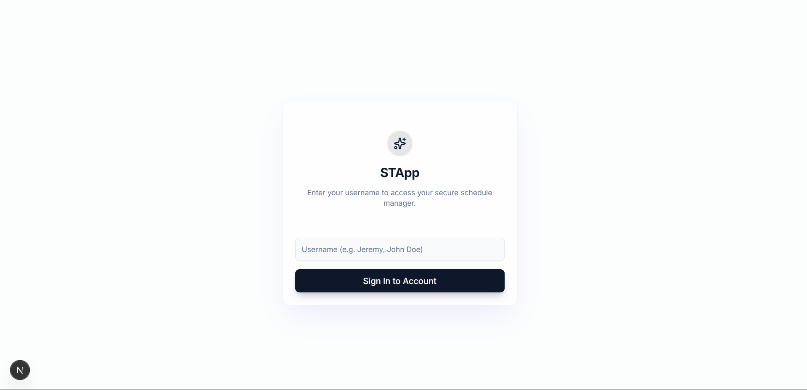
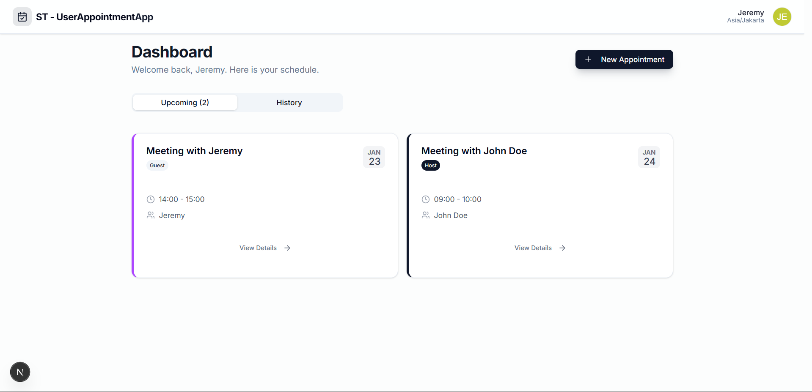
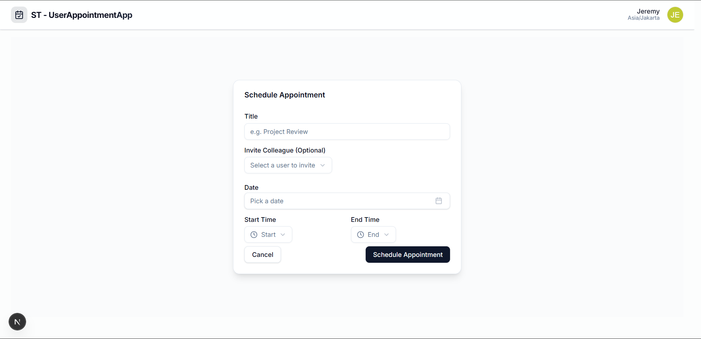
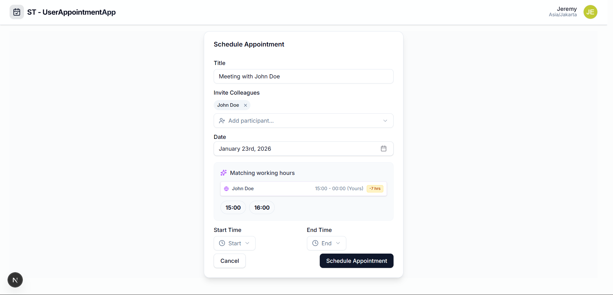

<div align="center">

<h1> Sari Tirta Appointment System 📅</h1>

<em>A smart appointment management tool designed to automatically handle timezone conflicts for seamless scheduling.</em>

[](https://nextjs.org/)
[](https://www.typescriptlang.org/)
[](https://www.prisma.io/)
[](https://supabase.com/)
[](https://tailwindcss.com/)

The Sari Tirta Appointment System is a robust web application built to solve the complexity of cross-timezone scheduling. It features intelligent validation logic that ensures appointments are only scheduled within valid working hours (08:00 - 17:00) for all participants, regardless of their location in the world.



</div>

---

## 📸 App Screenshots (Gallery)

A visual overview of the application's key features and smart functionalities.

### 🎥 Live Demo Preview
<div align="center">
  <a href="https://youtu.be/Z_4qxpQkfXc" target="_blank">
    
  </a>
  <p><em>Click the image above to watch the full demo on YouTube</em></p>
</div>

<br>

| **Login Screen** | **Main Dashboard (Upcoming & History)** |
| :---: | :---: |
|  |  |
| **Create New Appointment** | **Smart Time Recommendations** |
|  |  |
| *Clean form with date pickers.* | *Automatically suggests valid slots based on invitees' locations.* |

---

<div align="left">

<h1> 📑 Table of Contents </h1>

- [Installation & Setup 💻](#installation--setup-)
- [Database Configuration 🗄️](#database-configuration-%EF%B8%8F)
- [Demo Accounts 🧪](#demo-accounts-)
- [Features List 🔮](#features-list-)

</div>

## Installation & Setup 💻

To clone and run this application, you'll need [Git](https://git-scm.com) and [Node.js v18+](https://nodejs.org/) installed on your computer.

> [!IMPORTANT]
> Before running the app (`npm run dev`), you **MUST** configure the database first. See the [Database Configuration](#database-configuration-%EF%B8%8F) section below.

From your command line:

```bash
# 1. Clone this repository
git clone [https://github.com/jerrover/User-Appointment-Management-System](https://github.com/jerrover/User-Appointment-Management-System)

# 2. Go into the project directory
cd User-Appointment-Management-System

# 3. Install dependencies
npm install

# 4. Generate Prisma Client (Required to prevent DB errors)
npx prisma generate

# 5. Run the app locally
# (Make sure you have set up the .env file as shown in the section below)
npm run dev

```

## Database Configuration 🗄️

This application connects to a live **Supabase PostgreSQL** database. You do not need to install a local database engine (like XAMPP or Postgres Local).

```bash
# 1. Locate the example environment file
# It contains the active connection string for the testing database
$ ls .env.example

# 2. Rename it to .env
# Linux/Mac:
$ mv .env.example .env
# Windows (Command Prompt):
$ ren .env.example .env

```

## Demo Accounts 🧪

You can use these pre-registered accounts to simulate timezone conflicts without creating new users:

| Username | Role Scenario | Timezone | Notes |
| --- | --- | --- | --- |
| **Jeremy** | Main User (You) | `Asia/Jakarta` | Use this to create appointments. |
| **John Doe** | European Colleague | `Europe/London` | Try inviting him at 08:00 WIB (Invalid). |
| **Sarah** | US Colleague | `America/New_York` | Try inviting her. |

*(Note: The login system uses simple username authentication. No password is required.)*

## Features List 🔮

* [x] <b>Smart Timezone Scheduling</b>: Automatic detection and validation of working hours for all participants.
* [x] <b>Availability Insight:</b> Visual indicators showing if a participant is available or outside working hours.
* [x] <b>Secure Authentication:</b> Session-based login (JWT) with HTTP-Only Cookies protection.
* [x] <b>Double-Side Validation:</b> Server-side logic to prevent scheduling errors via API manipulation.
* [x] <b>Responsive UI:</b> Modern interface built with Tailwind CSS and Shadcn UI.
